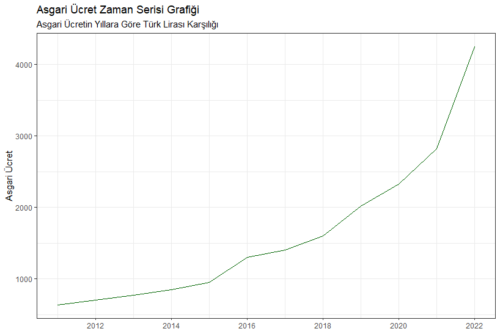
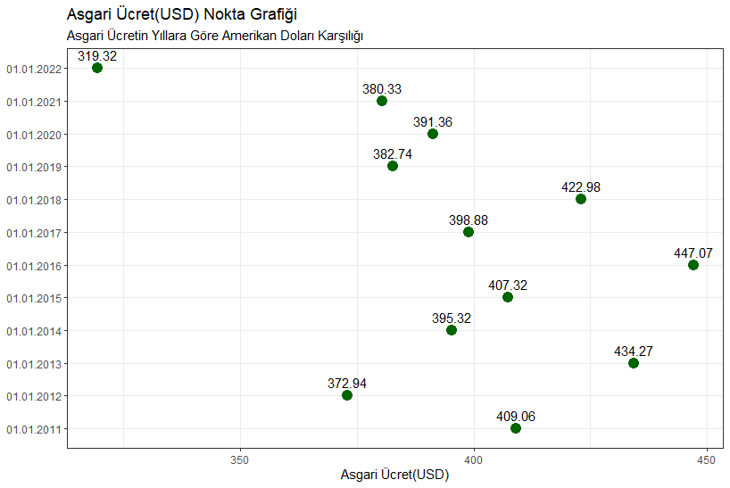
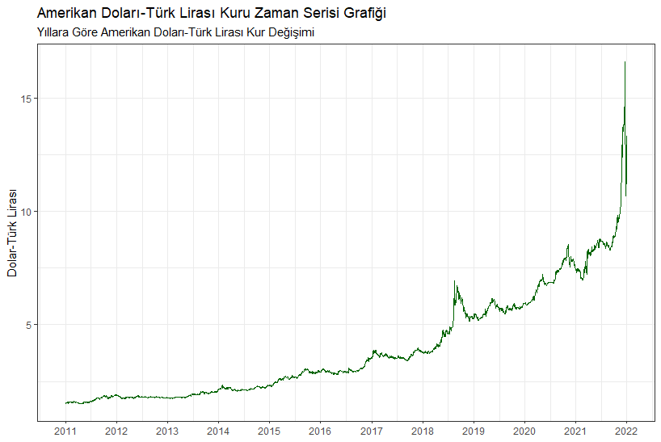

# Ekonomik Göstergeler Yorumlanırken Dikkat Edilmesi Gerekenler
Eskişehir Teknik Üniversitesi İstatistik Bölümü lisans programında, 2022-2023 Öğretim Yılı - Güz Dönemi'nde yürütülen Veri Görselleştirme dersi dönem sonu projesi materyallerini içerir.

## Özet
Ekonomik göstergeler yorumlanırken dikkatli olunmadığı takdirde istatistiksel yanılgılara yol açabilir. Bunlar veri yorumlama ve analizinde hatalara yol açabilecek yaygın hilelerdir. Bu projede gerçek hayattan bazı örneklerle bu durumlar incelenmiştir.

## Veri Seti
Türkiye Cumhuriyeti Çalışma ve Sosyal Güvenlik Bakanlığından yıllara göre asgari ücret verileri toplanıp bunların ilgili tarihlerdeki Türk Lirasının, Amerikan Doları karşılığına bakılarak dönüştürülmüştür.

PriceR paketindeki döviz kurları veri seti kullanılarak Türk Lirasının yıllara göre Amerikan Doları karşılığı incelenmiştir.

## Grafikler
### Asgari Ücretin Yıllara Göre Değişimini Gösteren Çubuk Grafiği

Bu grafikte asgari ücretin yıllara göre değişimi gösterilmektedir. Asgari ücrette düzenli bir artış görülmekte olup, son yıllarda daha keskin artışlar görülmektedir. Sadece bu grafik üzerinden asgari ücreti önceki yıllarla kıyaslayıp ülke ekonomisi hakkında bir görüş bildirmek hatalı olur. Bu artış refah artışı kaynaklı olabileceği gibi, paranın yüksek enflasyon karşısında değer kaybetmesi, ekonomik kriz gibi nedenlerden kaynaklı da olabilir.

### Asgari Ücretin Yıllara Göre Amerikan Doları Karşılığını Gösteren Nokta Grafiği

Bu grafikte asgari ücretin yıllara göre amerikan doları karşılığı gösterilmektedir. Burada nokta grafiği kullanılmasının sebebi, değerlerin o tarihteki asgari ücretin dolar karşılığı cinsinden olmasından dolayıdır. Noktalar arasında kur değişiminden kaynaklı asgari ücretteki değişim görülmemektedir veriler sürekli değil kesiklidir. Bu sebeple veriler sadece asgari ücrette düzenlemenin yapıldığı tarihteki amerikan doları karşılığını göstermektedir. 

Düzenlemenin öncesi ve sonrasındaki değişimin yıl içerisinde ne kadar olduğu belli olmadığı için tek başına bu grafik de her ne kadar bazı yüzeysel bigiler verse de ekonomi hakkında yorum yapmak adına yeterli değildir.

### Türk Lirasının Yıllara Göre Amerikan Doları Karşılığını Gösteren Zaman Serisi Grafiği

Bu grafikte Türk Lirasının yıllara göre Amerikan Doları karşılığını göstermektedir. Yıllar geçtikçe Türk Lirasının, Amerikan Dolarına karşı ciddi değer kaybı görülmektedir. Bu veri de tek başına tamamen yeterli olmamakla birlikte diğer grafiklerle de birlikte yorumlandığında önemli çıkarımlar yapılmasında yardımcı olmaktadır.

## Sonuç

Ekonomik göstergelere ait verileri yorumlarken, iddiaya uygun olanları seçip diğer verileri dahil etmemek veri ile alakalı dürüst olmamanın en kötü ve zararlı örneklerinden birisi olup bu konuda dikkatli olmak son derece önemlidir.
